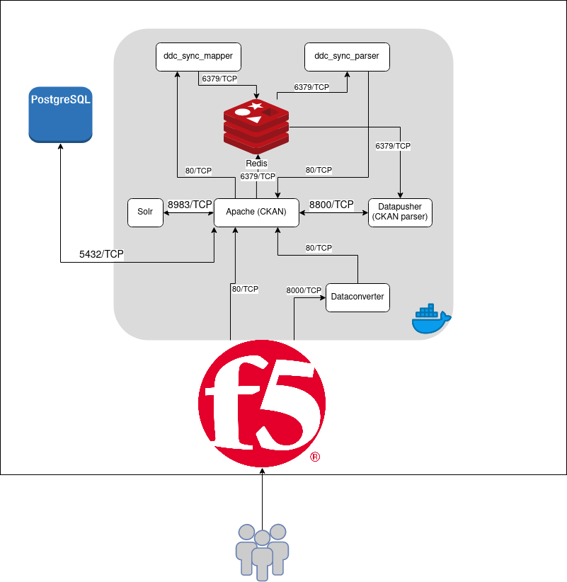

# CKAN CONCEPTS

## Structure (GNav)

```
- Databases:
    · PostgreSQL
    · Redis
    · Solr
- CKAN
- Datapusher
```



## Datapusher
Standalone web service that automatically downloads any tabular data files
like CSV or Excel from a CKAN site's resources when they are added to the CKAN
site, parses them to pull out the actual data, then uses the DataStore API to
push the data into the CKAN site's DataStore.

## Solr
CKAN uses Solr as search platform (indexation).

## Redis
System for asynchronous background jobs relies on Redis.

## PostgreSQL
Primary data store for CKAN.

## CKAN
Open-source DMS (Data Management System).Manage and publish collections of data.
Data is published in units named datasets -> parcels of data.
When users search for data, the results are individual datasets.

## Mapper
Plugin developed by DesideDatum for update checks.
Each time interval communicates with Redis to add a new task -> update data.

## Parser
Plugin developed by DesideDatum for update data automatically.

## Dataconverter
Plugin developed by DesideDatum for file convertions to Excel.

## F5
Company that specializes in application delivery networking (ADN), application 
availability & performance, multi-cloud management, application security,
network security, access & authorization and online fraud prevention. 

## Docker
Set of platform as a service (PaaS) products that use OS-level virtualization to
deliver software in packages called containers.
Most of the CKAN structura runs in docker containers.

##DataStore
Repository for persistently storing and managing collections of data.

## FireStore
ASK

